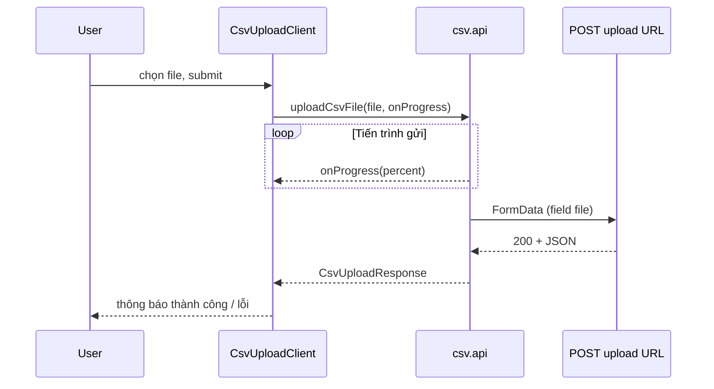

# Thư mục `app/file` — upload CSV (demo)

Tài liệu mô tả cấu trúc, vai trò từng file và luồng hoạt động của tính năng upload CSV với thanh tiến trình (%).

## Cấu trúc thư mục

| Đường dẫn | Mô tả |
|-----------|--------|
| [`page.tsx`](./page.tsx) | Trang Next.js (Server Component) tại route `/file`: metadata, layout, gắn component upload. |
| [`csv-upload-client.tsx`](./csv-upload-client.tsx) | Component client: form chọn file `.csv`, gọi API upload, hiển thị %, lỗi, kết quả. |
| [`csv.api.ts`](./csv.api.ts) | Tầng gọi HTTP: dùng **axios** với `onUploadProgress` để tính %; không dùng `fetch` (không có upload progress chuẩn trên browser). |
| [`csv.constants.ts`](./csv.constants.ts) | Hằng số dùng chung: tên field trong `FormData` (enum) — thống nhất với API nhận file. |
| `README.md` | File bạn đang đọc. |

**Lưu ý (API route nằm ngoài thư mục này):** theo [App Router của Next.js](https://nextjs.org/docs/app/building-your-application/routing/route-handlers), handler HTTP phải đặt dưới `app/api/...`. File demo tương ứng:

| Đường dẫn | Mô tả |
|-----------|--------|
| [`app/api/file/csv-upload/route.ts`](../api/file/csv-upload/route.ts) | `POST` nhận `multipart/form-data`, field tên theo `CsvUploadFormField.File`, kiểm tra file CSV, trả JSON `{ success, name, size }`. |

`csv.api.ts` gọi **trực tiếp** Nest (`http://localhost:4000/file/products/csv`). Route Next `app/api/file/csv-upload` chỉ còn hữu ích nếu bạn tự gọi tay / giữ làm demo phụ.

## Luồng hoạt động

1. Người dùng mở `/file`, chọn file có đuôi/kiểu CSV, bấm Upload.
2. `CsvUploadClient` gọi `uploadCsvFile(file, onProgress)` trong `csv.api.ts`.
3. `axios` gửi `POST` tới URL gắn cứng trong `csv.api.ts` (Nest) với `FormData` đính kèm file.
4. Trong lúc gửi, `onUploadProgress` cập nhật số % (`loaded` / `total`); component vẽ thanh progress + số %.
5. Server (Nest) trả JSON; UI hiển thị tên file, kích thước, số dòng import nếu thành công, hoặc thông báo lỗi nếu thất bại.

## URL backend

- Trong [`csv.api.ts`](./csv.api.ts), hằng số `NEST_CSV_UPLOAD_URL` trỏ tới Nest (mặc định dev: `http://localhost:4000/file/products/csv`). Đổi trực tiếp trong file khi cần host/port khác.

## Hợp đồng dữ liệu (gợi ý khi nối backend)

- **Request:** `POST` `multipart/form-data`, một phần tên field khớp `CsvUploadFormField` (hiện tại: `file`).
- **Response thành công (khớp `CsvUploadResponse` trong `csv.api.ts`):** `success: true`, `name` (tên file), `size` (số byte), tùy chọn `inserted` (số dòng import khi backend Nest/DB trả về).
- Nếu backend trả lỗi dạng JSON có `message` (string hoặc mảng string), `csv.api.ts` sẽ cố gắng hiển thị nội dung đó cho người dùng.

## Phụ thuộc bên ngoài thư mục

- [axios](https://axios-http.com/): bắt buộc cho upload + progress trên trình duyệt; phần còn lại của dự án vẫn có thể dùng [client dựa trên `fetch`](../lib/api/client.ts) cho API không cần % upload.
